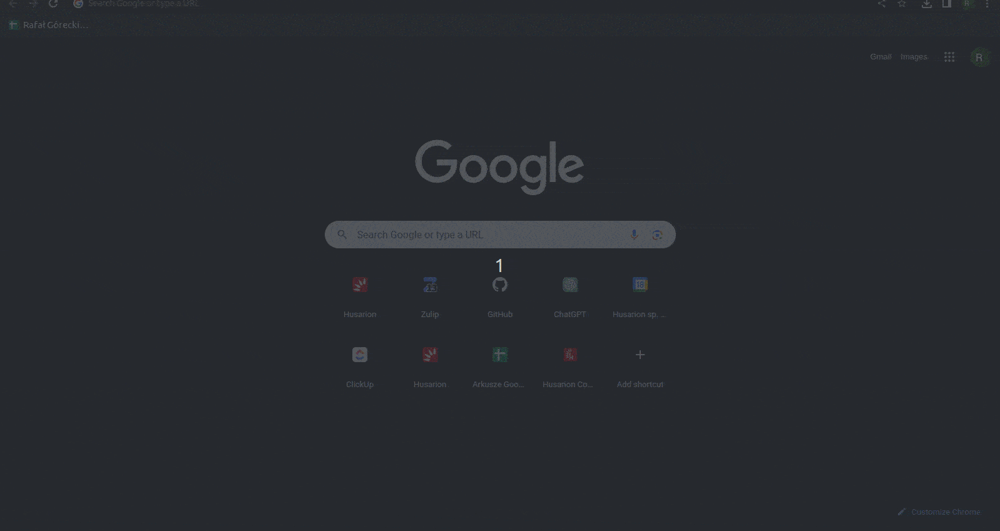

# rosbot-xl-sensors
Visualization for ROSbot XL sensors.

## Quick start

**1. Connect to your ROSbot via ssh.**

```bash title="user@device:~$"
ssh husarion@<ROSBOT_IP/HUSARNET_NAME>
```

**2. Clone the repository on your ROSbot.**

```bash title="husarion@husarion:~$"
git clone https://github.com/husarion/rosbot-xl-sensors
cd rosbot-xl-sensors
```

**3. Flash firmware.**

```bash title="husarion@husarion:~$"
docker stop rosbot-xl microros || true && \
docker run --rm -it --privileged \
--mount type=bind,source=/dev/ttyUSBDB,target=/dev/ttyUSBDB \
husarion/rosbot-xl:humble-0.8.2-20230913 \
flash-firmware.py -p /dev/ttyUSBDB
```

**4. Run Docker Compose.**

```bash title="husarion@husarion:~/rosbot-xl-sensors$"
docker compose up
```

**5. Open Foxglove application in browser.**

To open Foxglove type `<ROSBOT_IP/HUSARNET_NAME>:8080` in your browser search bar.

> [!NOTE]
> You should use **Chrome/Chromium** browser.

**6. Open connection.**

Inside Foxglove application, find **Data source** on left top and click the **`+`** then click `Open connection`. Use default **WebSocket URL** `ws://<ROSBOT_IP/HUSARNET_NAME>:9090` and click `Open`.

### Result

<div style={{width: '85%', margin: 'auto'}}>


</div>


